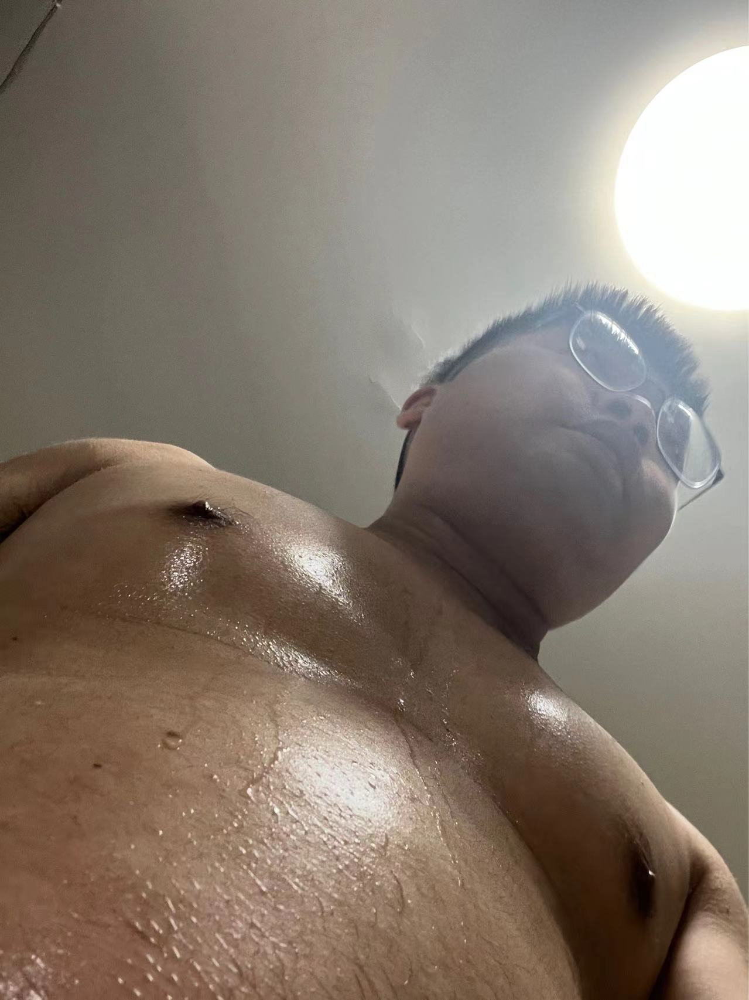

# 百天运动计划第5天

今天把大boss关过去了

事情不怕做不成功，就怕不坚持！！

今天把整个书房都收拾了下

同时也把显示器退了，感觉也没有必要。

台式机已经有显示器了，在买一个也是多余的。

现在听着音乐，写着日志，感觉真的挺好的。

再好，在大空间，如果不定时整理，其实都没有用。

就这样肆意的遨游，脑子放松且自由。

笔记本，如果只是随身携带，大小都是一样的，大的屏幕还看得舒服一点。

如果有确定的目标，达成目标的手段都只是表面的。

多追求本质上的，而不是敷于表面。

